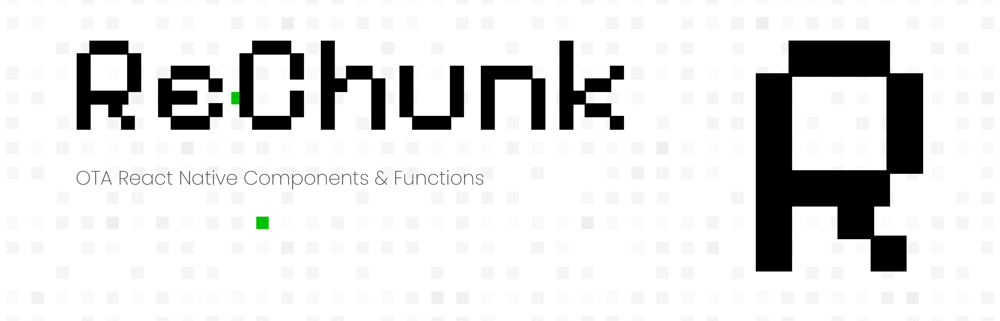

<picture>
  
</picture>

<br/>
<br/>

<div align="center">
<a href="https://www.npmjs.com/package/@rechunk/core"></a>
<a href="https://www.npmjs.com/package/@rechunk/core"></a>
<a href="https://bundlephobia.com/package/@rechunk/core"></a>
<a href="https://www.typescriptlang.org/"></a>
<a href="LICENSE.md"></a>
<a href="CONTRIBUTING.md"></a>
</div>

<br/>

<div align="center">
  <p><strong>ReChunk is a lightweight React Native library that enables secure over-the-air updates and dynamic component loading, allowing you to update your app's UI without app store submissions.</strong></p>
</div>

<div align="center">
  <a aria-label="rechunk.xyz" href="https://rechunk.xyz">Website</a>
  &nbsp;•&nbsp;
  <a aria-label="ReChunk Documentation" href="https://rechunk.xyz/docs/">Documentation</a>
  &nbsp;•&nbsp;
  <a aria-label="ReChunk Discord Community" href="https://discord.gg/xFhuxjwhss">Discord Community</a>
</div>

<br/>

## Why ReChunk?

- 📱 **Bypass App Store Updates**: Deploy UI changes without waiting for app store approval
- 🔄 **Instant Updates**: Push changes to all users simultaneously
- 🛠 **Developer Friendly**: Simple API with TypeScript support
- 🏃 **Performance First**: Minimal bundle size impact and optimized loading

## Installation

```bash
npm install @rechunk/core
npm install -D @rechunk/cli @rechunk/babel-plugin @rechunk/metro-config

# or

yarn add @rechunk/core
yarn add -D @rechunk/cli @rechunk/babel-plugin @rechunk/metro-config
```

## Quick Example

```tsx
'use rechunk';

import {View, Text, TouchableOpacity, StyleSheet} from 'react-native';
import React, {useState} from 'react';

interface FeatureCardProps {
  title: string;
  description: string;
  onPress?: () => void;
}

export default function RemoteFeatureCard({
  title = 'New Feature',
  description = 'Try out our latest update!',
  onPress,
}: FeatureCardProps) {
  const [pressed, setPressed] = useState(false);

  const handlePress = () => {
    setPressed(true);
    onPress?.();
  };

  return (
    <TouchableOpacity
      style={[styles.container, pressed && styles.pressed]}
      onPress={handlePress}>
      <View style={styles.content}>
        <Text style={styles.title}>{title}</Text>
        <Text style={styles.description}>{description}</Text>
      </View>
    </TouchableOpacity>
  );
}

const styles = StyleSheet.create({
  container: {
    backgroundColor: '#FFFFFF',
    borderRadius: 12,
    padding: 16,
    margin: 8,
    shadowColor: '#000',
    shadowOffset: {
      width: 0,
      height: 2,
    },
    shadowOpacity: 0.25,
    shadowRadius: 3.84,
    elevation: 5,
  },
  pressed: {
    opacity: 0.8,
    transform: [{scale: 0.98}],
  },
  content: {
    gap: 8,
  },
  title: {
    fontSize: 18,
    fontWeight: 'bold',
    color: '#000000',
  },
  description: {
    fontSize: 14,
    color: '#666666',
  },
});
```

## Features

- **🚀 Over-The-Air Updates**: Deploy React Native components instantly without app store submissions. Push UI changes directly to your users in real-time.
- **⚡️ Zero-Config Hosting**: Host your components anywhere - from S3 to your own servers. Zero vendor lock-in, maximum flexibility.
- **🔒 Built-in Security**: Industry-standard digital signatures verify every component. Keep your dynamic updates secure and your users protected.

## Getting Started

Visit our [Quick Start Guide](https://rechunk.xyz/docs/) to begin using ReChunk in your project.

## Community

Join our growing community! We're excited to help and hear your feedback:

- 💬 Join our [Discord](https://discord.gg/xFhuxjwhss) for real-time discussions
- ⭐ Star us on [GitHub](https://github.com/crherman7/rechunk) to show your support

## Contributing

Please read our [Contributing Guide](./CONTRIBUTING.md) and help us build ReChunk together. For questions or feedback, feel free to open an issue.

## Code of Conduct

Please review our [Code of Conduct](./CODE_OF_CONDUCT.md) for guidelines on community interaction.

## License

ReChunk is licensed under the [MIT License](./LICENSE.md).
